  <picture>
    <source media="(prefers-color-scheme: dark)" srcset="dark.svg">
    <source media="(prefers-color-scheme: light)" srcset="light.svg">
    
  </picture>

 

<h3 align="center">Hey there! 👋 I'm <strong>Soufiane</strong></h3>

  <em>Full Stack Developer · Open Source Contributor · UI Engineer</em>

  
  
  

---

### 🛠️ Tech Stack

  
  
  
  
  
  
  
  
  
  
  

---

### 📊 GitHub Stats

  
  

---

  <em>⚡ "Code is poetry written in logic."</em>

